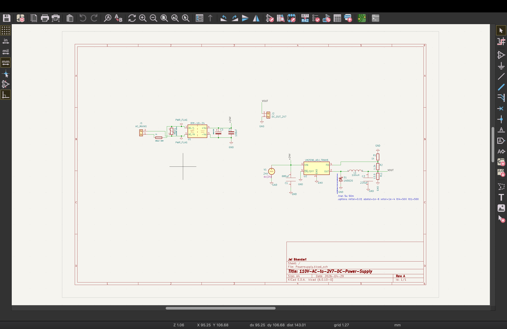
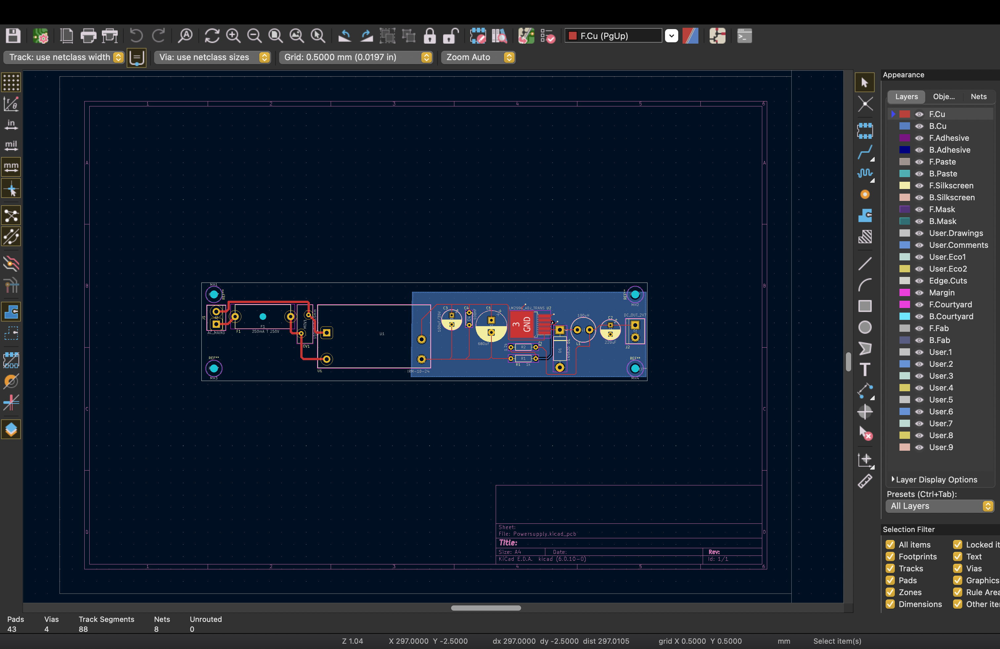

## 110V AC to 2.7V DC Isolated Power Supply

**Tools:** KiCad, LTspice  
**Topology:** Isolated flyback (IRM-10-24) + LM2596S-ADJ buck regulator  
**Output:** 2.7V DC, 200mA  

## What I Built
Designed a two-stage mains power supply from scratch. 
The first stage uses an isolated flyback module (IRM-10-24) 
to step down and isolate the 110V AC input. The second stage 
uses an LM2596S-ADJ adjustable buck regulator to regulate 
the output to 2.7V DC at 200mA.

## Design Process
- Schematic capture and component selection in KiCad
- LTspice simulation to validate circuit behavior
- BOM validation through datasheet analysis
- PCB layout with ERC/DRC verification and GND copper pour
- Bench validation of output voltage regulation and ripple

 ## Schematic

## PCB Layout

